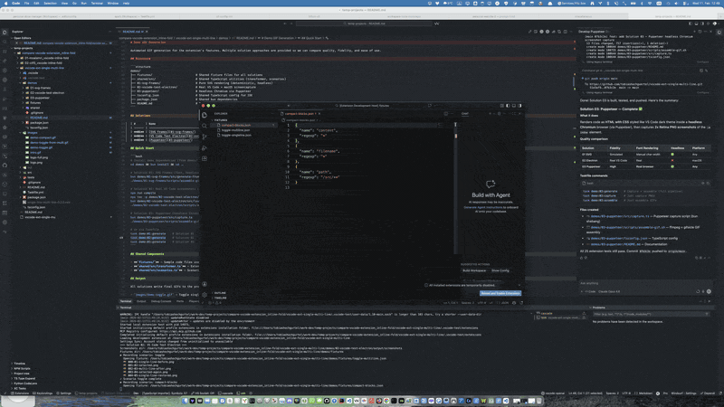

# Single-line, Multi-line


> **Fork of [SuperKXT/vscode-ext-single-multi-line](https://github.com/SuperKXT/vscode-ext-single-multi-line)**
> with SOLID refactoring, modern tooling, and a new **Compact Blocks** feature.

---

## Features

### Toggle Single-line ↔ Multi-line (original)

Toggles selected text between single & multi-lines.
Works on Arrays, Objects, Assignments, & other comma/semicolon-separated text.

**_If selected text has no line breaks:_**

Adds line breaks:

1. Before or after Comma `,`
2. After Semicolon `;`
3. After Opening Brackets `[ { (`
4. Before & After Closing Brackets `] } )`

**_If selected text has at least one line break:_**

Removes all line breaks.

_Note: The code is formatted by calling the format command, which will use your preferred code formatter._

### Compact Blocks (new)

Compacts multiple multiline `{ }` blocks into **one block per line**, preserving indentation and commas.

**Before** (select all lines, then run `Compact Blocks`):

```json
            {
                "name": "content",
                "regexp": "*"
            },
            {
                "name": "filename",
                "regexp": "*"
            },
```

**After:**

```json
            { "name": "content", "regexp": "*" },
            { "name": "filename", "regexp": "*" },
```

---



---

## Commands

| Command                                   | Description                               |
| ----------------------------------------- | ----------------------------------------- |
| `Single-line, Multi-line: Toggle`         | Toggle between single-line and multi-line |
| `Single-line, Multi-line: Compact Blocks` | Compact each `{ }` block to a single line |

## Keyboard Shortcuts

| Shortcut     | Mac          | Command                     |
| ------------ | ------------ | --------------------------- |
| `Ctrl+Alt+S` | `Ctrl+Cmd+S` | Toggle (comma on same line) |
| `Ctrl+Alt+X` | `Ctrl+Cmd+X` | Toggle (comma on new line)  |
| `Ctrl+Alt+B` | `Ctrl+Cmd+B` | Compact Blocks              |

### Changing Key Bindings

- Open up Your Key Bindings by:
  - Pressing `Ctrl + K`, `Ctrl + S`
  - Pressing `Ctrl + Shift + P` and type Keyboard Preferences
- Type `Single-line, Multi-line` in the search box.
- Assign different keys by:
  - Clicking the pencil icon that shows on hover
  - Right clicking the shortcut and selecting `Change Keybinding`
  - Pressing `Enter` with a command selected

---

## Development

### Prerequisites

- Node.js >= 18
- npm

### Setup

```bash
npm install
npm run compile
```

### Testing

```bash
npm test              # Run all tests
npm run test:unit     # Run unit tests only
npm run test:unit:watch  # Watch mode
```

### Task Runner (Taskfile)

This project uses [Task](https://taskfile.dev) for maintenance:

```bash
task install          # Install dependencies
task compile          # Build with esbuild
task test             # Run tests
task lint             # Run ESLint
task package          # Create .vsix package
task publish:vscode   # Publish to VS Code Marketplace
task publish:openvsx  # Publish to Open VSX
task publish:all      # Publish to both
task release          # Full release: lint → test → package → publish
task sync-upstream    # Merge upstream changes
task version:patch    # Bump patch version
```

---

## Changes from Original

- **New Feature**: `Compact Blocks` command — compact multiple multiline `{ }` blocks to one-per-line
- **SOLID Refactoring**: Separated parsing (`parser.ts`), transformation (`transformer.ts`), and types (`types.ts`)
- **Modern Tooling**: esbuild bundler, ESLint (replacing deprecated tslint), vitest, TypeScript 5.x
- **Test Structure**: Tests moved to `./tests/{unit,integration,e2e,bdd}`
- **Taskfile.yml**: For build, test, package, and publish workflows

## License

MIT — see [LICENSE](LICENSE) for details.

## Credits

- Original extension by [SuperKXT](https://github.com/SuperKXT)
- Fork maintained by [Tobias Hochgürtel](https://github.com/tobiashochguertel)
